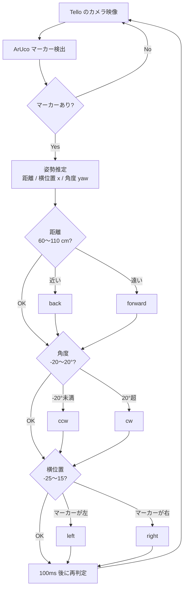

# Tello Control with AR Marker

Tello のカメラで ArUco マーカーを検出し、**距離・向き・横位置** を推定。
マーカーの正面・一定距離を保つように、ドローンが自動で位置を合わせ続けます。

<!-- デモ動画：GitHub の編集画面に mp4 をドラッグ&ドロップすると URL が生成されるので、下の行と置き換えてください -->
<p align="center">
  <a href="https://youtu.be/qgd4qfcZtI">
    
  </a>
</p>

## 仕組み



映像処理・移動制御・UDP 通信を別スレッドに分け、映像の遅延を抑えています。

## 使い方

```bash
pip install opencv-contrib-python numpy
# PC を Tello の Wi-Fi に接続してから、リポジトリ直下で実行
python move/move.py
```

| `j` | `k` | `w` / `s` | `h` / `l` | **`b`** | `q` |
|:---:|:---:|:---:|:---:|:---:|:---:|
| 離陸 | 着陸 | 前進 / 後退 | 上昇 / 下降 | **自動追従 ON/OFF** | 終了 |
